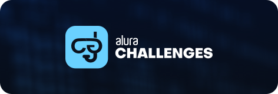

  

    Desafio Front-End

###
Um projeto em forma de desafio proposto pela [alura](https://www.alura.com.br/), para ajudar a desenvolver habilidades, participar em um projeto que simula o ambiente de trabalho e criar um portfólio.

Recebemos um layout no figma com uma base para desenvolver todo o projeto, e toda semana recebemos cards no trello com que será desenvolvido durante aquela semana.

As ferramentas básicas para desenvolver são HTML, CSS e JavaScript. Mas cada um tem a liberdade para usar frameworks caso ache necessário para aperfeiçoar o projeto.